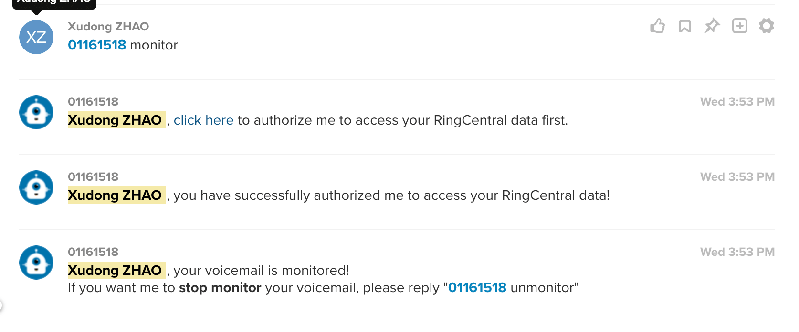
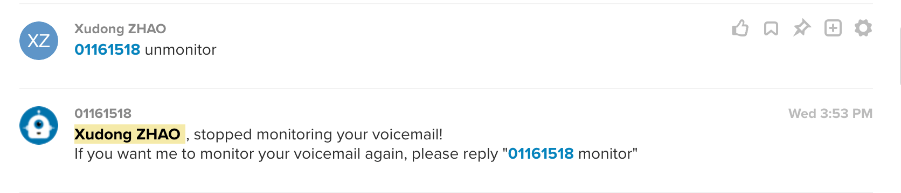
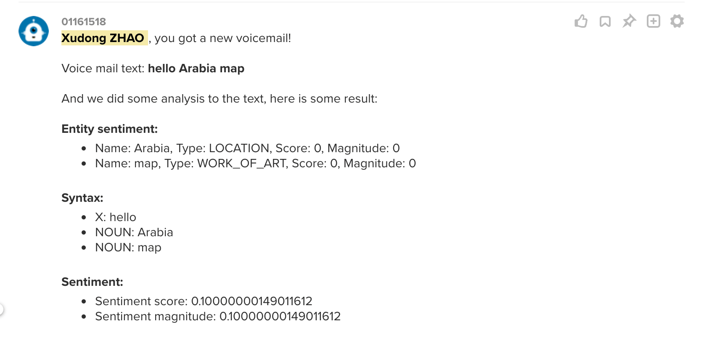

# ringcentral-chatbot-skill-voicemail-helper <!-- omit in toc -->

RingCentral Chatbot skill: Voicemail transcript and AI analysis.

Support command: `monitor`, `unmonitor`, after user authurization, bot will watch for new voicemails of the user, and transcript any new voicemail, and do some analysis with Google API.

## Table of Contents <!-- omit in toc -->

- [Screenshots](#screenshots)
- [Prerequisites](#prerequisites)
- [Use](#use)
- [Test](#test)
  - [Create the Apps](#create-the-apps)
    - [Server/Bot App](#serverbot-app)
    - [Web-based App](#web-based-app)
  - [After apps created, you can get app client id and secret, put them in `.env`](#after-apps-created-you-can-get-app-client-id-and-secret-put-them-in-env)
  - [Start the bot server](#start-the-bot-server)

## Screenshots





## Prerequisites

- nodejs/npm
- a Google API account with a saved Google credentials file, note that you can still run local demo to see how it works without Google account/credential, but with fake demo data, Set env in `.env`:

```env
## for Google Cloud API credential path
GOOGLE_APPLICATION_CREDENTIALS=path-to-google-credential.json
```

- Login to [developer.ringcentral.com](https://developer.ringcentral.com) and [create browser based app](#Web-based-App). Set env in `.env`:

```env
## ringcentral web-based app for rc user auth
RINGCENTRAL_CLIENT_ID=
RINGCENTRAL_CLIENT_SECRET=
```

## Use

```bash
import createApp from 'ringcentral-chatbot/dist/apps'
import skill from 'ringcentral-chatbot-skill-voicemail-helper'

const handle = async event => {
  if (event.type === 'Message4Bot' && event.text.toLowerCase() === 'about') {
    //do something
  }
}

const app = createApp(handle, [ skill ])

```

## Test

```bash
git clone git@github.com:zxdong262/ringcentral-chatbot-skill-voicemail-helper.git
cd ringcentral-chatbot-skill-voicemail-helper
npm i

## start proxy
npm run ngrok
## will get Forwarding  https://xxxx.ngrok.io -> localhost:3000

## create config file
cp .env.sample .env

```

### Create the Apps

Login to [developer.ringcentral.com](https://developer.ringcentral.com) and create two different apps using the parameters below.

#### Server/Bot App

- General Settings
  - Choose a name and description you prefer.
- App Type and Platform
  - **Application Type**: Public
  - **Platform Type**: `Server/Bot`
  - **Carrier**: *accept the default values*
- OAuth Settings
  - **Permissions Needed**: All of them (ReadContacts, ReadMessages, ReadPresence, Contacts, ReadAccounts, SMS, InternalMessages, ReadCallLog, ReadCallRecording, WebhookSubscriptions, Glip)
  - **OAuth Redirect URI**: Using your ngrok HTTPS URL from above, enter in the following value:
          `https://xxxx.ngrok.io/bot/oauth`

#### Web-based App

- General Settings
  - Choose a name and description you prefer. 
- App Type and Platform
  - **Application Type**: Public
  - **Platform Type:*- `Browser-based`
  - **Carrier**: *accept the default values*
- OAuth Settings
  - **Permissions Needed**: All of them (ReadContacts, ReadMessages, ReadPresence, Contacts, ReadAccounts, SMS, InternalMessages, ReadCallLog, ReadCallRecording, WebhookSubscriptions, Glip)
  - **OAuth Redirect URI**: Using your ngrok HTTPS URL from above, enter in the following value:
    `https://xxxx.ngrok.io/rc/oauth`

### After apps created, you can get app client id and secret, put them in `.env`

### Start the bot server

```bash
npm start
## server runs on http://localhost:3000
```

Then you can goto bot app's bot menu, add the bot, and login to [https://glip-app.devtest.ringcentral.com](https://glip-app.devtest.ringcentral.com) to talk to the bot, try `@bot monitor` and `@bot unmonitor` command.
